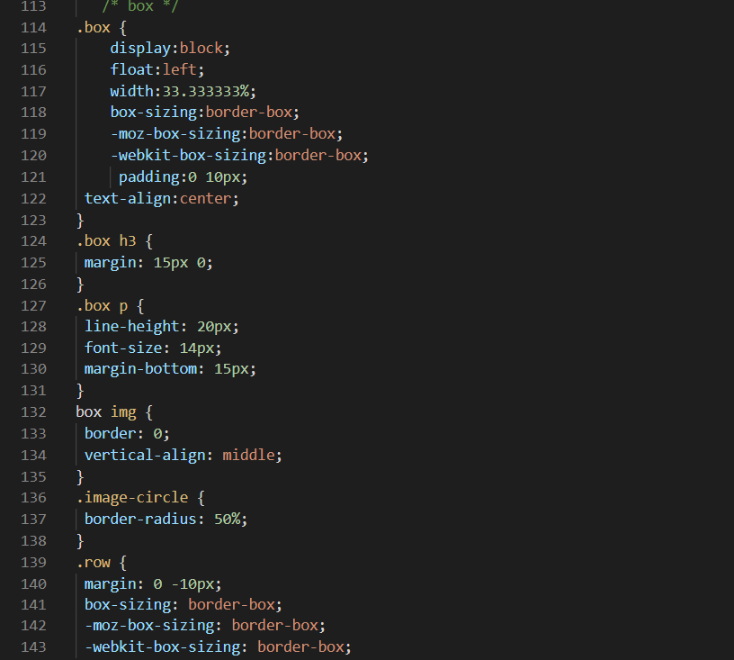

# Lab4Web

Nama  : Bangkit Akbar Anggara 
NIM   : 312010148 
Kelas : TI.20.B.1 

Berikut adalah tugas praktikum 4 
 

## Membuat Box Element
Kita buat dulu html Box Elementnya berikut screenshotnya atau kalian bisa mengaksesnya dengan klik disamping [Click Here](lab4_box.html)
  - Pertama - tama kita buat dulu Box ELement seperti dibawah ini 
 
  - Maka hasilnya akan seperti dibawah ini 
 
  - Lalu kita buat CSS float property seperti dibawah ini untuk warna bebas kalian pilih jika mau 
 
  - Maka hasil akhir dari Box ELement akan seperti berikut 
 

## Membuat Layout Sederhana
Selanjutnya kita akan membuat layout sederhana berikut screenshotnya atau kalian bisa mengaksesnya dengan klik disamping [(Click Here Html)](lab4_layout/Home.html) [(Click Here CSS)](lab4_layout/style.css) 
  - Pertama - tama kita buat dulu awalannya seperti dibawah ini 
 
  - Lalu kita tambahkan kode CSS seperti berikut, kalian bebas mengubah warna dan font sesuka kalian jika kalian mau 
 
  - Lalu kita tambahkan juga navigasi seperti dibawah ini 
 
  - Maka hasil dari layout sederhana akan menjadi seperti berikut 
 
  - Selanjutnya itu kita akan membuat Hero Panelnya 
 
  - Kita tambahkan CSSnya 
 
  - Setelah itu kita buat layout main dan sidebar 
 
 
  - Lalu kita buat sidebar widgetnya juga 
 
  - Lalu kita tambahkan CSSnya
 
  - Berikut adalah hasilnya 
 
  - Selanjutnya kita akan mengatur footer 
 
  - Berikut adalah hasilnya 
 
  - Selanjutnya kita tambahkan Elemen lainnya pada Main Content 
 
  - Tambahkan juga CSSnya 
 
 
  - Berikut adalah hasilnya 
 
  - Setelah itu kita tambahkan Content Artikel 
 
  - Tambahkan juga CSSnya 
 
  - Berikut adalah hasil akhirnya 
 

## Pertanyaan dan Tugas
 
## Jawaban
1.Kalian bisa mengakses htmlnya dengan klik disamping [Click Here](lab4_layout/About.html) 
Berikut adalah hasilnya 
 
Jadi disini kita buat navigasi Home htmlnya memanggil si About agar saat kita klik about di browser maka akan memunculkan about htmlnya 
2.Setelah itu kita buat form dikontak kalian bisa mengakses htmlnya dengan klik disamping [Click Here](lab4_layout/Kontak.html) 
Berikut adalah hasilnya 
 
Seperti diatas setelah kita buat htmlnya selanjutnya kita buat agar navigasi kontak dapat memanggil html kontak 
### By  : Bangkit Akbar Anggara - 312010148 - TI.20.B.1
